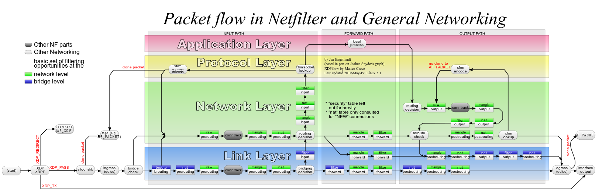

# Network Notes on Linux, Kubernetes, etc

## Packet in Linux Path

[Packet flow in Netfilter and General Networking]

[mYu4N/mytracer] also provides a good diagram (ported [here](./img/Linux_Packet_Sending_and_Receiving_Kernel_Path.png)).

[leandromoreira/linux-network-performance-parameters] provides a guide for tuning network parameters in the Linux kernel to improve network performance. The packet flow in this article is impressive. Some eBPF interception points are added here.

### Ingress - they're coming
1. Packets arrive at the NIC.
2. NIC will verify `MAC` (if not on promiscuous mode) and `FCS` and decide to drop or continue.
3. NIC will [DMA packets at RAM](https://en.wikipedia.org/wiki/Direct_memory_access), in a region previously prepared (mapped) by the driver.
4. NIC will enqueue references to the packets at the receive [ring buffer](https://en.wikipedia.org/wiki/Circular_buffer) queue `rx` until `rx-usecs` timeout or `rx-frames`.
5. NIC will raise a `hard IRQ`.
6. CPU will run the `IRQ handler` that runs the driver's code.
7. Driver will `schedule a NAPI`, clear the `hard IRQ`, and return.
8. Driver raises a `soft IRQ (NET_RX_SOFTIRQ)`.
9. NAPI will poll data from the receive ring buffer until `netdev_budget_usecs` timeout or `netdev_budget` and `dev_weight` packets.
10. An XDP eBPF program can be attached here to process the packet. It can drop the packet, redirect it, or pass it to the kernel stack for further processing. (eBPF interception point, by Gemini)
11. Linux will also allocate memory to `sk_buff`.
12. Linux fills the metadata: protocol, interface, setmacheader, removes ethernet.
13. Linux will pass the skb to the kernel stack (`netif_receive_skb`).
14. It will set the network header, clone `skb` to taps (i.e., tcpdump), and pass it to tc ingress.
15. A TC eBPF program can be attached here to filter or modify the packet. (eBPF interception point, by Gemini)
16. Packets are handled to a qdisc sized `netdev_max_backlog` with its algorithm defined by `default_qdisc`.
17. It calls `ip_rcv` and packets are handed to IP.
18. It calls netfilter (`PREROUTING`).
19. It looks at the routing table, if forwarding or local.
20. If it's local, it calls netfilter (`LOCAL_IN`).
21. It calls the L4 protocol (for instance `tcp_v4_rcv`).
22. It finds the right socket.
23. It goes to the TCP finite state machine.
24. Enqueue the packet to the receive buffer and sized as `tcp_rmem` rules.
    1. If `tcp_moderate_rcvbuf` is enabled, the kernel will auto-tune the receive buffer.
25. Kernel will signal that there is data available to apps (epoll or any polling system).
26. Application wakes up and reads the data.

### Egress - they're leaving
1. Application sends a message (`sendmsg` or other).
2. TCP send message allocates `skb_buff`.
3. It enqueues `skb` to the socket write buffer of `tcp_wmem` size.
4. A socket filter eBPF program can be attached here to filter or modify the packet before it enters the TCP stack. (eBPF interception point, by Gemini)
5. Builds the TCP header (src and dst port, checksum).
6. Calls L3 handler (in this case `ipv4` on `tcp_write_xmit` and `tcp_transmit_skb`).
7. L3 (`ip_queue_xmit`) does its work: build IP header and call netfilter (`LOCAL_OUT`).
8. Calls output route action.
9. Calls netfilter (`POST_ROUTING`).
10. Fragment the packet (`ip_output`).
11. Calls L2 send function (`dev_queue_xmit`).
12. A TC eBPF program can be attached here to filter or modify the packet before it is passed to the driver. (eBPF interception point, by Gemini)
13. Feeds the output (QDisc) queue of `txqueuelen` length with its algorithm `default_qdisc`.
14. The driver code enqueues the packets at the `ring buffer tx`.
15. The driver will do a `soft IRQ (NET_TX_SOFTIRQ)` after `tx-usecs` timeout or `tx-frames`.
16. Re-enable hard IRQ to NIC.
17. Driver will map all the packets (to be sent) to some DMA'ed region.
18. NIC fetches the packets (via DMA) from RAM to transmit.
19. After the transmission, NIC will raise a `hard IRQ` to signal its completion.
20. The driver will handle this IRQ (turn it off).
21. And schedule (`soft IRQ`) the NAPI poll system.
22. NAPI will handle the receive packets signaling and free the RAM.

## kube-proxy iptables rules

Flowchart of kube-proxy iptables rules provided by Tim Hockin in his [x post](https://x.com/thockin/status/1191766983735296000) ([svg link](https://docs.google.com/drawings/d/1MtWL8qRTs6PlnJrW4dh8135_S9e2SaawT410bJuoBPk/edit)).

[Packet flow in Netfilter and General Networking]: https://upload.wikimedia.org/wikipedia/commons/3/37/Netfilter-packet-flow.svg
[mYu4N/mytracer]: https://github.com/mYu4N/mytracer
[leandromoreira/linux-network-performance-parameters]: https://github.com/leandromoreira/linux-network-performance-parameters
[A Deep Dive into Iptables and Netfilter Architecture]: https://www.digitalocean.com/community/tutorials/a-deep-dive-into-iptables-and-netfilter-architecture